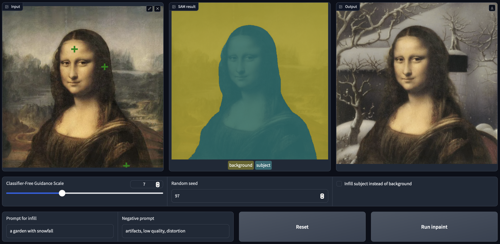
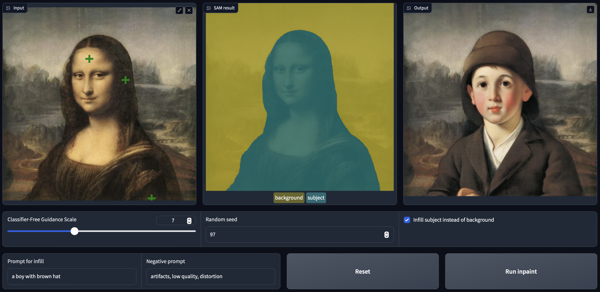

# Background Replacement App with Stable Diffusion

This project creates a web app that allows users to swap out the background or the subject in an image with a new background generated by Stable Diffusion through a text prompt.

## Introduction

This project leverages the Segment Anything Model (SAM) from Meta to generate segmentation masks and Stable Diffusion for generating new backgrounds based on text prompts. The app is built with Python and uses the following libraries:

PIL (Python Imaging Library)
Transformers
Diffusers
Torch
Numpy

## Screenshots

## Code Explanation

### Loading SAM
First, we import the necessary libraries and set up the device (GPU or CPU). We then load the pretrained SAM model and processor from Facebook/Meta. The SAM model is used for generating segmentation masks of the subject in the image, which allows us to separate the subject from the background.

### Getting the Mask
We define a function to generate a segmentation mask using SAM. The mask helps us identify the area of the image that contains the subject. We then test this function using an example image of a car, visualizing the mask to ensure it's correctly identifying the subject.

### Inpainting
We load the inpainting pipeline from the diffusers library and define the inpainting function. This function takes the raw image, the mask generated by SAM, and a text prompt to generate a new background. The function also allows for optional negative prompts and seeds for repeatability.

Testing the inpainting function involves providing a text prompt to generate a new background and visualizing the result alongside the original image and the mask.

### Interactive App
To make the app interactive, we use Gradio to create a web interface. This allows users to upload an image, run SAM to generate the mask, and then use the text prompt to generate a new background. Users can access the app through a public URL generated by Gradio.

